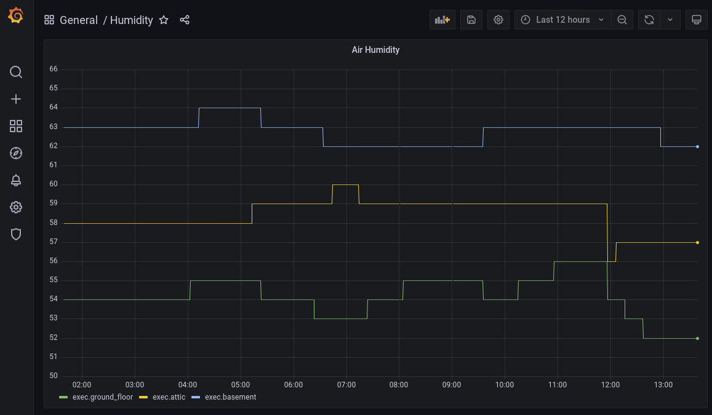

### Netatmo indoor climate metrics on grafana: Running telegraf, influxdb and grafana on a self-hosted kubernetes raspberry-pi-'cluster'.

Yesterday I uploaded a [utility container](https://hub.docker.com/r/floak/telatmo) to poll data from the [Netatmo API](https://dev.netatmo.com/).
Today I would like to illustrate how I am using it at home.
It runs on kubernetes together with influxdb and grafana.

### Install kubernetes
I used [this guide](https://alexellisuk.medium.com/walk-through-install-kubernetes-to-your-raspberry-pi-in-15-minutes-84a8492dc95a) to install kubernetes on my raspberry pi.
Not much to add.

### Run the stack

I crammed everything into a single file and all containers into a single deployment: observer.yaml.
I might split up the defined deployments in the future, so that three components are independently maintainable. 

Anyhow, for now all you need to do is to change the values for line 7 to 10.
You find the required values when registering as a user of the [Netatmo API](https://dev.netatmo.com/).
Thereafter, run:

```shell
kubectl apply -f observer.yaml
```

Assuming all went well, [telatmo]((https://hub.docker.com/repository/docker/floak/telatmo) ) starts right away to inbound data to your influxdb.
Enter `http://raspberrypi.local:30001/` (or similar) in your browser and start exploring the data.
Add the influxdb as a datasource (the db name is telegraf).
Create a dashboard and some graphs.

Personally, I am using the following graph to convince my wife that I need more air-conditioning gadgets [[plants](https://www.homestratosphere.com/plants-lower-humidity/), air-con, [magic](https://drytech.dk/drymat-system-uk/), ...].



Both, the datasource and the dashboard could be [provisioned](https://grafana.com/docs/grafana/latest/administration/provisioning/) by extending the grafana image used, so you don't have to configure them manually after the deployment.


 